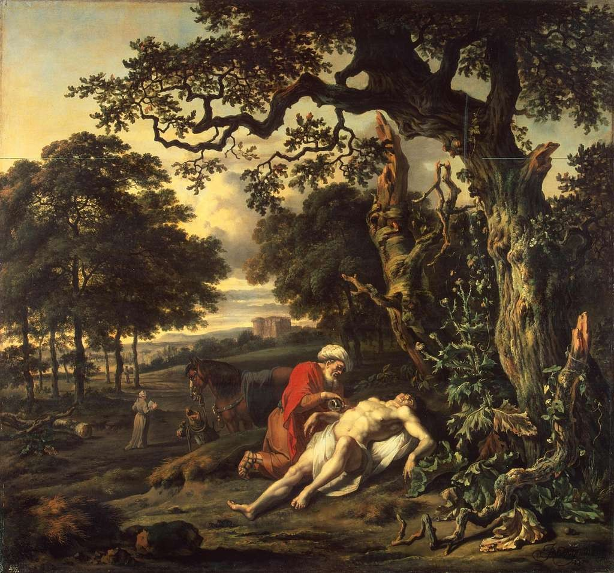

```{=html}
<style>
.essay-header {
  text-align: center;
  max-width: 780px;
  margin: 3rem auto 2.5rem;
  padding: 0 1rem;
}
.essay-header h1 {
  font-family: 'Cormorant Garamond', Georgia, serif;
  font-size: 3rem;
  font-weight: 700;
  color: #0d3b66;
  line-height: 1.15;
  margin-bottom: 0.6rem;
  letter-spacing: -0.01em;
}
.essay-header .subtitle {
  font-family: 'Spectral', Georgia, serif;
  font-size: 1.2rem;
  font-style: italic;
  color: #5a7a95;
  margin-bottom: 0.6rem;
}
.essay-header .dek {
  font-family: 'Spectral', Georgia, serif;
  font-size: 1rem;
  color: #5a7a95;
  margin-bottom: 1.2rem;
  line-height: 1.5;
}
.essay-header .byline {
  font-family: 'Inter', sans-serif;
  font-size: 0.82rem;
  color: #5a7a95;
  letter-spacing: 0.04em;
  text-transform: uppercase;
}
.essay-header .byline a {
  color: #5a7a95;
  text-decoration: none;
  border-bottom: 1px solid #d9cfb8;
}
.essay-header .byline a:hover { border-bottom-color: #1e5a8e; color: #1e5a8e; }
.essay-epigraph {
  max-width: 620px;
  margin: 2rem auto 2.5rem;
  padding-left: 1.5rem;
  border-left: 2px solid #1e5a8e;
  font-family: 'Spectral', Georgia, serif;
  font-style: italic;
  color: #1e5a8e;
  font-size: 1.05rem;
  line-height: 1.6;
}
.essay-epigraph .attr {
  font-style: normal;
  font-size: 0.9rem;
  margin-top: 0.4rem;
}
.essay-books {
  max-width: 700px;
  margin: 0 auto 3rem;
  font-family: 'Spectral', Georgia, serif;
  font-size: 0.95rem;
  line-height: 1.75;
  color: #0d3b66;
}
.essay-books a { color: #1e5a8e; text-decoration: none; border-bottom: 1px solid #d9cfb8; }
.essay-books a:hover { border-bottom-color: #1e5a8e; }
.essay-figure {
  margin: 3.5rem auto;
  max-width: 780px;
  text-align: center;
}
.essay-figure img {
  width: 100%;
  border-radius: 2px;
  box-shadow: 0 8px 30px rgba(10, 37, 64, 0.18), 0 2px 8px rgba(10, 37, 64, 0.10);
}
.essay-figure img.portrait {
  max-width: 380px;
}
.essay-figure .caption {
  font-family: 'Inter', sans-serif;
  font-size: 0.82rem;
  color: #5a7a95;
  margin-top: 0.75rem;
  letter-spacing: 0.01em;
  line-height: 1.5;
}
.essay-pullquote {
  max-width: 620px;
  margin: 3.5rem auto;
  padding: 0 1.5rem;
  border-left: 3px solid #1e5a8e;
  text-align: left;
}
.essay-pullquote p {
  font-family: 'Cormorant Garamond', Georgia, serif;
  font-size: 1.5rem;
  font-weight: 500;
  line-height: 1.45;
  color: #0d3b66;
  font-style: italic;
  margin: 0;
}
.essay-break {
  margin: 4rem auto;
  max-width: 120px;
  border: none;
  border-top: 1px solid #d9cfb8;
}
.essay-biblio {
  max-width: 700px;
  margin: 3rem auto;
  font-family: 'Spectral', Georgia, serif;
  font-size: 0.92rem;
  line-height: 1.8;
  color: #0d3b66;
}
.essay-biblio h3 {
  font-family: 'Cormorant Garamond', Georgia, serif;
  font-size: 1.2rem;
  font-weight: 600;
  color: #0d3b66;
  margin-bottom: 1rem;
  text-align: center;
  letter-spacing: 0.06em;
  text-transform: uppercase;
}
.essay-biblio a { color: #1e5a8e; text-decoration: none; border-bottom: 1px solid #d9cfb8; }
.essay-biblio a:hover { border-bottom-color: #1e5a8e; }
/* Hide Quarto's auto-rendered title block — we use our own custom header */
#title-block-header { display: none !important; }
.quarto-title-block { display: none !important; }
</style>

<div class="essay-header">
  <h1>St Olaf, the English, and the Insufficiency of Institutional Religion</h1>
  <div class="byline"><a href="https://www.linkedin.com/in/jonathan-lancaster-0a22a1136" target="_blank">Jonathan Lancaster</a> &nbsp;·&nbsp; 15 May 2026 &nbsp;·&nbsp; 12-minute read</div>
</div>

<div class="essay-epigraph">
  I will not cease from mental fight,<br/>
  Nor shall my sword sleep in my hand,<br/>
  Till we have built Jerusalem<br/>
  In England's green and pleasant land.
  <div class="attr">William Blake, <em>Jerusalem</em> (1804)</div>
</div>

<hr class="essay-break"/>
```

Recently I returned to London, the city of my childhood, in time to attend the founders' commemoration of my former high school. Being an infrequent visitor to London, I was surprised by how the patriotic plinths and magisterial grandeur hit me emotionally as I wandered east across Westminster. Strolling past Victoria — Queen Imperial — seated in almost absurd proportions outside Buckingham Palace, it was hard not to feel drawn into a community of something bigger, of a national project. The efforts, many of them cruel and calculating, by which this city has been built are celebrated with a peculiarly British pomposity that visitors from abroad come to admire. And the very fact that so many tourists were flocking to see these icons reinforced the sense of national achievement. For a moment, I was unexpectedly hit with a pang of patriotism that I struggled to understand, let alone justify.

Yet beyond the edifices of central London, there is little that consistently binds the British, and even less the English.

## Building Jerusalem

Downstream of Westminster, on the south bank of the Thames, is Southwark Cathedral, where the school of Saint Olave's commemorates its founding in 1571. Among the presiding stone figures inside the Cathedral, St Olaf (the original Norwegian spelling) stands out in a rough sheepskin cloak, with an axe swung over his shoulder and a shield resting at his feet. Meanwhile, in the Cathedral transepts, there are plaques for the school's founders, among them Robert Harvard, whose son would later found the eponymous university. The service consisted of a brief history of the school, hymns, and prayers. It is an opportunity for students and staff to recommit to "work for the common good" and "to pursue and preserve for future generations [the school's] ideals, values and scholarship." Among the songs sung, few captured the bravado of striving towards a collective future more aptly than William Blake's *Jerusalem*:

> *I will not cease from mental fight,*
> *Nor shall my sword sleep in my hand,*
> *Till we have built Jerusalem*
> *In England's green and pleasant land.*

(It is widely believed Blake wrote the words in an opium-induced stupor.)

```{=html}
<div class="essay-figure">
  
  <div class="caption">Southwark Cathedral, south bank of the Thames. Saint Olave's Grammar School has commemorated its 1571 founding here for centuries. <em>Photo: British Pilgrimage Trust</em></div>
</div>
```

The ceremony was about belonging to something bigger, to an educational project across generations possessing its own culture, values — and expectations: the expectation to be as foresighted, as benevolent, and as community-minded as the founders, and as courageous as St Olaf. This message was confidently couched in the creeds of the Church of England, the state religion. Given how averse public institutions are in today's Britain to accusations of favouring any particular religious viewpoint (especially traditional or "conservative" views), I was surprised by how unabashedly Anglican the ceremony had remained. How important was Anglicanism in building students' sense of responsibility to contribute to Blake's Jerusalem struggle?

The students of St Olave's are selected aged eleven according to academic performance and receive a decidedly academic education. Most are funnelled into the UK's top universities. Like other state-funded English grammar schools, it walks a tightrope between an egalitarian ideal — offering a private school-style education to anyone based on merit, not fees — and the unspoken reality that students are predominantly from middle-class backgrounds. Many are privately tutored to pass the entrance exam, and 12% come from private primary schools. Research in 2016 suggested grammar schools had no positive effect on social mobility. Yet they remain popular in small parts of England: author Terry Pratchett, chef Heston Blumenthal, and Prime Minister Theresa May all attended state grammar schools. Not all these schools remain as strongly tied to the Church of England as St Olave's, but they continue to cater disproportionately for the middle class. Footfall into Anglican churches continues to be notably well-heeled, albeit increasingly elderly. Many participants of institutionalised religion in England are therefore drawn from similar social circles.

In the context of recent local elections across England, the reaffirmation of traditional so-called Christian values appeared symptomatic of a search for English identity. The elections demonstrate how polarised the English electorate has become: between parties promoting "progressive values" and environmental concerns (the Greens), and those espousing a return to "traditional Christian values" and more hostile immigration policies (Reform UK). Against this backdrop, seeing a school of mostly non-white British students sing and recite Anglican prayers presented a puzzle: was the religious aspect simply window dressing? Downright offensive? Or can traditional Christian ideals promote communal responsibility among today's students, and counter the trend of division and isolation?

## Blake: Duty and Responsibility

The message these "elite" students received during the commemoration service was that they are privileged to receive such a first-rate education, but that with it comes a duty to excel and to benefit society. They would be the builders of Blake's Jerusalem, however ill-defined that might be.

> *May this celebration of our school and our history*
> *serve as a catalyst to move us forward and cause growth in all areas*
> *of our school's life. May we leave here recognising You are the*
> *God of all wisdom who leads us ever forward. Amen.*

Regardless of any pressure from family and teachers, God apparently expected them to push forward in this endeavour, just like those before them. Diligence and attention to His way — "support to the weak, help the afflicted, honour everyone" — would ultimately be rewarded. This is not merely a humanist mantra of "do your best" reframed in theistic language. The entire ceremony recalled the community across time and space of which Olavian students were members; to do your best was not simply out of duty to oneself, but a responsibility owed to the school past and present, and to society more broadly. "Though many," the students "form one body" (Romans 12:5), each with different gifts which, when absent, cause the whole body to suffer. Initially, this emphasis on collective responsibility in an age of fragmented individualism and isolation felt refreshing. Perhaps it could even be the blueprint for a Christian nationalism that encourages inclusive, rather than exclusive, communal identity built around the responsibility of every individual to one another.

```{=html}
<div class="essay-pullquote">
  <p>To do your best was not simply out of duty to oneself, but a responsibility owed to the school past and present, and to society more broadly.</p>
</div>
```

A more critical examination of this intersection of institutional Christianity and elite state education reveals a nationalist discourse with considerable lineage. This is *governmentality*, to use a Foucauldian concept, by which individual minds are guided to think in terms of community and corporate responsibility, not merely individuality. It follows the narrative set in British public schools, military academies, and the Victorian industrial class — with a stiff upper lip — where every individual has a societal role and is contributing to a national project. Its intention is to render the collective endeavour a natural one, and to inculcate responsibility in the national subjects.

This narrative rings hollow today. It sounds painfully outdated. If you asked any of the students present to explain what sort of national project they were a part of, I doubt many would give a clear answer. There is no collective Jerusalem being built today.

But more troubling, within the context of "Christian" nationalism more widely, is the failure to present the full message of Christ. The passage quoted from Proverbs includes the line "lean not on your own understanding," yet no explanation or defence of adopting humility in deference to God's moral framework was provided. Nor was anything said of God's unconditional love, of humanity's chronic selfishness, or of our dismal track record of trying to make collective endeavours benefit more than a select minority. No mention was made of why, faced with this failure, humanity's ultimate need is mercy and reconciliation — to themselves, to each other, to their environment, and to their Maker. Yes, institutionalised religion offered a moral framework for the British establishment until the mid-twentieth century. By contrast, humanism struggles to justify why human life and community have any intrinsic value. Institutional religion can create obligations through peer pressure and the superficial demarcation of one's "Englishness." But giving a diverse body of students — or citizens more generally — a set of ethics has not succeeded in generating any meaningful sense of societal duty in the twenty-first century. The English are quick to grumble and appeal to their rights; but mentioning a duty to the very national institutions that proffer those rights, or responsibility to community members, rapidly makes many people uncomfortable. Where today's society is content to talk about rights but reticent to accept responsibility or "duty," traditionalism, including institutional religion, initially appears a helpful tool. But it does almost nothing to affect individuals' heartfelt attitudes.

```{=html}
<hr class="essay-break"/>
```

## Olaf: Religion as Signifier

```{=html}
<div class="essay-figure">
  
  <div class="caption">King Olaf the Holy, by Peter Nicolai Arbo (c. 1860). Patron saint of Norway and the figure for whom Saint Olave's Grammar School is named. <em>Public domain</em></div>
</div>
```

King Olaf experienced the limits of institutional Christianity as a nation-building tool. After besieging Canterbury in 1011 (seat of the Church of England), pillaging south-east England, and pulling down London Bridge in 1014, he was baptised in Normandy and returned to Norway. Although widely credited with the Christianisation of that country and celebrated as its patron saint, King Olaf showed more interest in territorial expansion and subjugating pagan Scandinavians than in the teachings of his new religion. Realising that Norway lacked theologians and priests, and finding resistance among the Sami farmers and their religion, he imported bishops from England. Christianity was a tool to foster a single national identity, but it remained skin-deep for many. Previously pagan subjects had little personal belief or affiliation to Christ. Perhaps all that could be realistically expected was that the socioeconomic necessity of being accepted as a member of the national group would engender some notion of national loyalty.

In addition to helping individuals make sense of their existence, institutional religion in England historically demarcated in-group versus out-group — citizen versus dissenter or foreigner. The community created by the Church of England over centuries has, at times, helped galvanise national identity across regions and class. From Cornish tin miners to Cumbrian sheep farmers, Yorkshire seamstresses to London landladies — at one point, virtually all would hear the same liturgy on a Sunday, and pray for the monarch, the head of the church. Religion has admittedly had some success at building national identity.

```{=html}
<hr class="essay-break"/>
```

## Jesus: The Insufficiency of Institutionalised Religion

Olaf's subjects, however, would surely tell us that however fervent the new religion became in their land, they experienced none of the self-sacrificial pastoral care exhibited by Jesus from their king. To have any chance of being attracted to this new religious nationalism on grounds other than personal interest and self-preservation, most individuals want living examples of what following Jesus involved — not mere doctrine, creeds, and hymns. Likewise in England today, where collective identity is lacking, bland religion with its rules, rituals, and community of practice lacks the power to genuinely affect people's hearts. It can continue to signify in-group versus out-group, and some on the right are using it that way. English Christian nationalism currently involves vilifying the liberal elite, the immigrant, and the Muslim. Values of kindness, forbearance, self-denial, and reconciliation cannot be expected without personal experience of the generosity and mercy of God — whether that occurs through religious exploration or an encounter with others who practise those values.

Encountering such individuals — with radically different worldviews — seems increasingly rare in England, even in cosmopolitan London. The often-cited online echo chambers are mirrored in the physical realm by factors that reinforce class difference and inequality. When Jesus taught those wanting to follow him to "Seek first the kingdom of God and all these will be added to you," he expected people to be attentive to the subjects of his kingdom. These invariably were outcasts and downcasts: the poor in money and poor in spirit, those who mourned and who hungered for justice (Gospel of Matthew, ch. 5). Seeking first the kingdom means joining people who recognise their dependence on a power greater than themselves, and who find freedom from shame and freedom from the world's labels through their acceptance into a divine family. Christian nationalism and a return to national institutions such as the Anglican church will not, on their own, lead to this personal liberation; in their worst forms, they actually trap individuals in cycles of hate and suspicion, all too easily inflamed by the politicians and technologies of today.

```{=html}
<div class="essay-pullquote">
  <p>Bland religion, with its rules, rituals, and community of practice, lacks the power to genuinely affect people's hearts. It can continue to signify in-group versus out-group — and some on the right are using it that way.</p>
</div>
```

Institutional religion, with its typically English stiff upper lip, cannot achieve much more than a begrudging allegiance to community. Christian nationalism (and Christian fascism) is used to justify abominable policies in order to privilege one group over another. Jesus clearly elevated the service of others — regardless of creed — above the duty to serve a particular nation (see the Parable of the Good Samaritan, and Matthew 22:21). His disciples included a Roman tax collector alongside an anti-imperial freedom fighter.

```{=html}
<div class="essay-figure">
  
  <div class="caption"><em>The Parable of the Good Samaritan</em>, Jan Wijnants (1670). Jesus elevated the service of strangers above national or religious loyalty. <em>Public domain</em></div>
</div>

<hr class="essay-break"/>
```

Naturally, I would rather students be made aware of Christianity in full — all of it, including God as Father, not merely as a demanding schoolmaster. National divisions are unlikely to heal if tomorrow's leaders are entirely detached from a sense of Englishness or larger community. But as Olaf experienced, a return to tradition and institutional religion is not the answer. God forbid that the label "Christian" becomes any more a denoter of resentment towards outsiders: what could be less authentically Christian? Because ultimately, though Jesus was divisive, those who followed him retreated not into bitter isolationism, but spread infectious joy.

---

*[Jonathan Lancaster](https://www.linkedin.com/in/jonathan-lancaster-0a22a1136) is a collaborator at the Rabat Review of Books, living between Ukraine and England.*

```{=html}
<div class="essay-biblio">
  <h3>Further Reading</h3>
  William Blake, <em><a href="https://en.wikipedia.org/wiki/Milton:_A_Poem">Milton: A Poem</a></em> (1804–1810) — source of the <em>Jerusalem</em> lyric<br/>
  Snorri Sturluson, <em><a href="https://en.wikipedia.org/wiki/Heimskringla">Heimskringla</a></em> (c. 1230) — the primary saga source on King Olaf Haraldsson<br/>
  Michel Foucault, <em><a href="https://en.wikipedia.org/wiki/Discipline_and_Punish">Discipline and Punish</a></em> (1975) — on governmentality and the production of national subjects<br/>
  <a href="https://www.suttontrust.com/our-research/grammar-schools-social-mobility/">Sutton Trust, <em>Grammar Schools and Social Mobility</em> (2016)</a><br/>
  Matthew 5–7 (Sermon on the Mount); <a href="https://www.biblegateway.com/passage/?search=Luke+10%3A25-37&version=NIV">Luke 10:25–37</a> (Parable of the Good Samaritan); <a href="https://www.biblegateway.com/passage/?search=Romans+12&version=NIV">Romans 12</a><br/>
  <a href="https://reformuk.com/our-policies/">Reform UK, <em>Our Policies</em></a> (2024)
</div>
```
