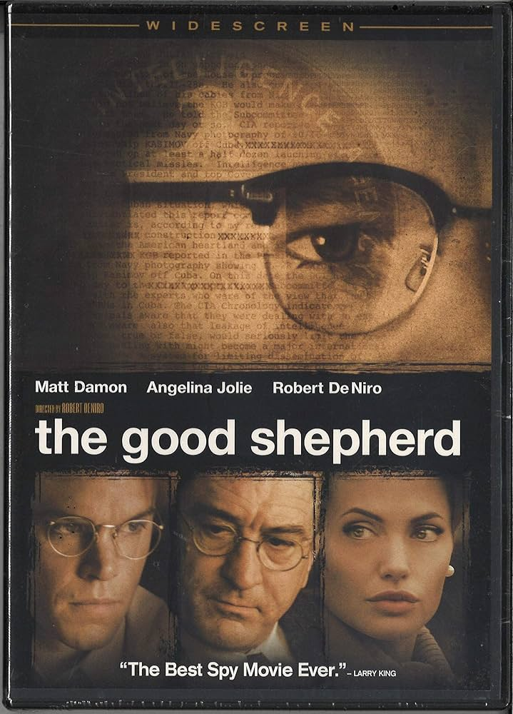
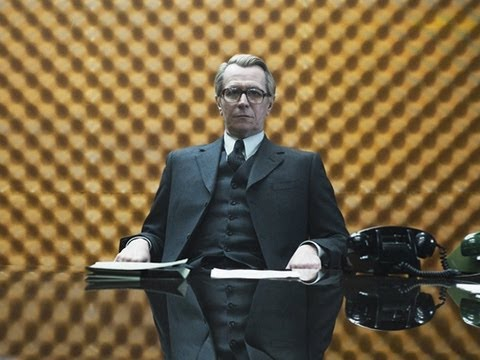
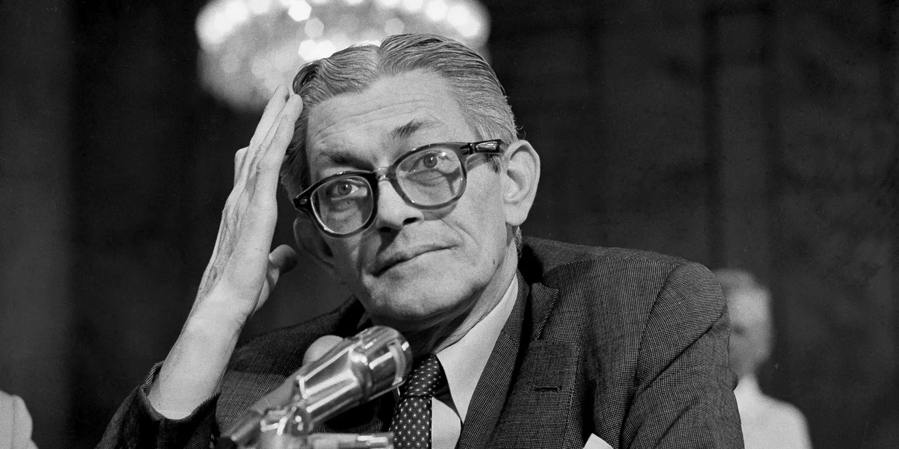
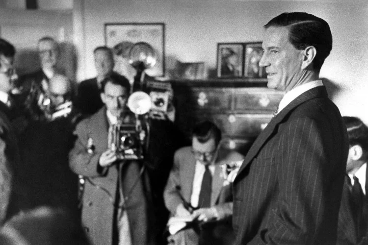
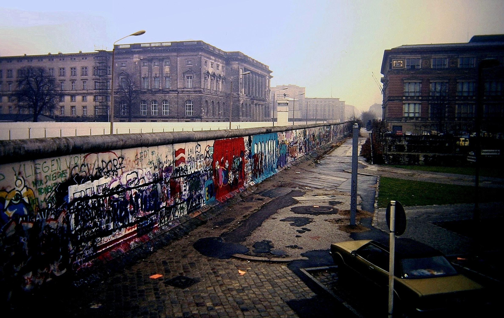
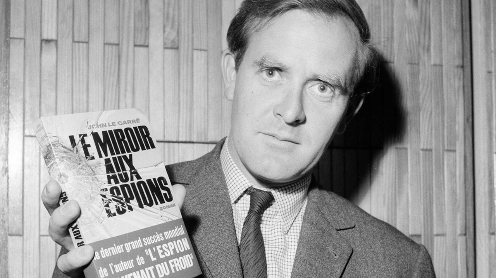

```{=html}
<style>
.essay-header {
  text-align: center;
  max-width: 780px;
  margin: 3rem auto 2.5rem;
  padding: 0 1rem;
}
.essay-header h1 {
  font-family: 'Cormorant Garamond', Georgia, serif;
  font-size: 3rem;
  font-weight: 700;
  color: #0d3b66;
  line-height: 1.15;
  margin-bottom: 0.6rem;
  letter-spacing: -0.01em;
}
.essay-header .subtitle {
  font-family: 'Spectral', Georgia, serif;
  font-size: 1.2rem;
  font-style: italic;
  color: #5a7a95;
  margin-bottom: 1.2rem;
}
.essay-header .byline {
  font-family: 'Inter', sans-serif;
  font-size: 0.82rem;
  color: #5a7a95;
  letter-spacing: 0.04em;
  text-transform: uppercase;
}
.essay-epigraph {
  max-width: 620px;
  margin: 2rem auto 2.5rem;
  padding-left: 1.5rem;
  border-left: 2px solid #d9cfb8;
  font-family: 'Spectral', Georgia, serif;
  font-style: italic;
  color: #5a7a95;
  font-size: 1.05rem;
  line-height: 1.6;
}
.essay-epigraph .attr {
  font-style: normal;
  font-size: 0.9rem;
  margin-top: 0.4rem;
}
.essay-books {
  max-width: 700px;
  margin: 0 auto 3rem;
  font-family: 'Spectral', Georgia, serif;
  font-size: 0.95rem;
  line-height: 1.75;
  color: #0d3b66;
}
.essay-books a { color: #1e5a8e; text-decoration: none; border-bottom: 1px solid #d9cfb8; }
.essay-books a:hover { border-bottom-color: #1e5a8e; }
.essay-figure {
  margin: 3.5rem auto;
  max-width: 780px;
  text-align: center;
}
.essay-figure img {
  width: 100%;
  border-radius: 2px;
  box-shadow: 0 8px 30px rgba(10, 37, 64, 0.18), 0 2px 8px rgba(10, 37, 64, 0.10);
}
.essay-figure .caption {
  font-family: 'Inter', sans-serif;
  font-size: 0.82rem;
  color: #5a7a95;
  margin-top: 0.75rem;
  letter-spacing: 0.01em;
  line-height: 1.5;
}
.film-covers {
  display: flex;
  gap: 2rem;
  justify-content: center;
  margin: 3rem auto;
  max-width: 680px;
  flex-wrap: wrap;
}
.film-cover {
  flex: 1;
  min-width: 180px;
  max-width: 300px;
  text-align: center;
}
.film-cover img {
  width: 100%;
  max-height: 420px;
  object-fit: cover;
  border-radius: 3px;
  box-shadow: 0 10px 35px rgba(10, 37, 64, 0.22), 0 3px 10px rgba(10, 37, 64, 0.12);
}
.film-cover .cover-title {
  font-family: 'Cormorant Garamond', Georgia, serif;
  font-size: 0.95rem;
  font-weight: 600;
  color: #0d3b66;
  margin-top: 0.8rem;
}
.film-cover .cover-detail {
  font-family: 'Inter', sans-serif;
  font-size: 0.75rem;
  color: #5a7a95;
  margin-top: 0.2rem;
}
.essay-pullquote {
  max-width: 620px;
  margin: 3.5rem auto;
  padding: 0 1.5rem;
  border-left: 3px solid #1e5a8e;
  text-align: left;
}
.essay-pullquote p {
  font-family: 'Cormorant Garamond', Georgia, serif;
  font-size: 1.5rem;
  font-weight: 500;
  line-height: 1.45;
  color: #0d3b66;
  font-style: italic;
  margin: 0;
}
.essay-break {
  margin: 4rem auto;
  max-width: 120px;
  border: none;
  border-top: 1px solid #d9cfb8;
}
.essay-biblio {
  max-width: 700px;
  margin: 3rem auto;
  font-family: 'Spectral', Georgia, serif;
  font-size: 0.92rem;
  line-height: 1.8;
  color: #0d3b66;
}
.essay-biblio h3 {
  font-family: 'Cormorant Garamond', Georgia, serif;
  font-size: 1.2rem;
  font-weight: 600;
  color: #0d3b66;
  margin-bottom: 1rem;
  text-align: center;
  letter-spacing: 0.06em;
  text-transform: uppercase;
}
.essay-biblio a { color: #1e5a8e; text-decoration: none; border-bottom: 1px solid #d9cfb8; }
.essay-biblio a:hover { border-bottom-color: #1e5a8e; }
</style>

<div class="essay-header">
  <h1>Tinker, Tailor, Soldier, Empire</h1>
  <div class="subtitle">On spymasters, gentlemen, and the violence they learned not to see.</div>
  <div class="byline">Mehdi Khribch · 12 April 2026</div>
</div>

<div class="essay-epigraph">
  In a wilderness of mirrors, what will the spider do?
  <div class="attr">T.S. Eliot, <em>Gerontion</em></div>
</div>

<hr class="essay-break"/>
```

In Robert De Niro's *The Good Shepherd* (2006), a film that traces the institutional origins of American intelligence through the biography of a single composite operative, there is a scene of clarifying brutality. Matt Damon's Edward Wilson, a senior CIA officer fashioned from the lives of Angleton, Richard Bissell, and the Ivy League men who built the Agency in their own image, sits across from a Mafia boss played by Joe Pesci. The question posed is ethnographic: what do your people have? The Italians have families. The Jews have memory. The Irish have grievance. Wilson, without pause, without emphasis, offers what is less a reply than a deed of title: we have the United States of America; the rest of you are just visiting. The statement is not dramatic. It is administrative. It is the sound of sovereignty explaining itself to those it merely tolerates.

The scene encapsulates something the spy genre has circled for decades without always naming directly. Not the mechanics of espionage but the social architecture that made espionage feel, to certain men, like a natural extension of their birthright. That the defence of civilisation should fall to well-bred Protestants from the Ivy League seemed, to the generation that founded the Office of Strategic Services and its successor, not a proposition but a fact of nature. The Central Intelligence Agency was built, in its earliest years, as a gentleman's club with a licence to intervene anywhere on earth.

```{=html}
<div class="essay-figure">
  
  <div class="caption"><em>The Good Shepherd</em> (2006). De Niro's film understands that the Skull and Bones ritual and the waterboarding of a prisoner in a Central American cell are not contradictions but iterations.</div>
</div>

<div class="essay-figure">
  
  <div class="caption">Gary Oldman as George Smiley in Alfredson's <em>Tinker Tailor Soldier Spy</em> (2011). A man of almost geological patience, inhabiting rooms drained of colour.</div>
</div>
<hr class="essay-break"/>
```

Among the men who made this architecture, James Jesus Angleton holds a singular, almost literary position. He is not simply a historical figure; he is, in the specific sense that Thomas Powers used the term, a phenomenon. Born in Boise in 1917, raised partly in Milan where his father ran the National Cash Register franchise, educated at an Ivy League university where he co-founded the literary journal *Furioso* and corresponded with Ezra Pound, T.S. Eliot, E.E. Cummings. He was admitted to the modernist inner circle before he was admitted to intelligence, and the sequence matters. Angleton imported into the CIA the habits of mind he had learned from the New Critics: Richards, Empson, the conviction that every text conceals a subtext, that ambiguity is not noise but signal, that the surface of things is a provocation to deeper reading.

He ran the Agency's counterintelligence directorate from 1954 to 1975, and during those two decades he became the most feared, most respected, and ultimately most destructive figure in American intelligence. His obsession was totality: a unified theory of Soviet deception so comprehensive that it could explain any piece of evidence, including evidence that contradicted itself. The defector Anatoliy Golitsyn, who arrived in Washington in 1961, provided the seed; Angleton cultivated it into what the CIA would later call, in a classified internal study, "the Monster Plot," the belief that the KGB had orchestrated a vast programme of disinformation so subtle that every subsequent defector, every apparent split in the Communist bloc, every diplomatic thaw was itself part of the deception.

```{=html}
<div class="essay-figure">
  
  <div class="caption">James Jesus Angleton, chief of CIA counterintelligence, 1954–1975. He applied the techniques of literary criticism to the decryption of Soviet intentions and became, in the process, the author of the very conspiracy he claimed to have uncovered.</div>
</div>
```

The brilliance of Powers's review in the *London Review of Books* lies in its identification of the precise mechanism of failure. Angleton read the world as he had read *Four Quartets*: assuming that surfaces concealed depths, that every testimony was potentially a dangle, that silence itself was a legible text. He had confused intelligence work with textual exegesis. The Monster Plot was, ultimately, his own composition, its author and sole reader alike, bound within a hermeneutic circle no countervailing evidence could penetrate. The consequences were institutional: careers destroyed, genuine defectors turned away, the Agency's Soviet division paralysed for a decade. But the consequences were also, and this is what we on the receiving end cannot afford to forget, projected outward, into countries and continents where Angleton's paranoid architecture translated into operational violence. The distance afforded by empire, the luxury of treating intelligence as an intellectual exercise, was never available to those whose lives constituted the raw material.

```{=html}
<div class="essay-pullquote">
  <p>Angleton read the world as he read poetry: every surface concealed a deeper meaning, every defector was a potential dangle, every silence was a text to be decoded. The Monster Plot was his own composition.</p>
</div>
<hr class="essay-break"/>
```

To understand Angleton, one must understand the betrayal that shaped him. Kim Philby, Harold Adrian Russell Philby, recruited by Soviet intelligence in 1934 while at Cambridge, risen through MI6 to its highest operational levels, stationed in Washington as liaison to the CIA where he and Angleton became close friends, drinking companions, confidants. Philby's defection to Moscow in 1963 did not merely damage Western intelligence. It shattered something more intimate: the assumption that one could read a man by his class, his education, his manner, and know with certainty which side he served.

```{=html}
<div class="essay-figure">
  
  <div class="caption">Kim Philby at his 1955 press conference, denying he was the 'third man.' He would defect to Moscow eight years later, leaving behind a devastated Angleton and a ruined service.</div>
</div>
```

Philby's treachery was not systemic malfunction but systemic consequence. The Cambridge spies, all five of them, were products of a social order that could not conceive of betrayal from within because its entire legitimacy rested on the premise that its members were, by breeding and formation, incapable of it. The system's strength was its weakness. The old school tie was both credential and camouflage. Something in the Cold War's moral landscape, in the bourgeois certainties it promised to defend, produced its own negation: men who, having seen the machinery of their class at close range, concluded that the other side, for all its brutalities, at least possessed the courage of ideological conviction. Philby's was not the treachery of greed but of contempt, the contempt of a man who found the moral emptiness of his own side more intolerable than the violence of the alternative.

This connects Philby, across decades and continents, to a longer arc that begins perhaps with T.E. Lawrence, another Oxbridge product dispatched to manage the edges of empire, who returned from Arabia with the knowledge that the promises made to the people he had led were lies, and that the imperial system for which he had fought was incapable of the honour it claimed. Lawrence's disillusionment, like Philby's, was not a failure of the individual but a revelation about the structure. The fall of empire, mishandled at every stage, from the Sykes-Picot carve-up through Suez, produced a class of administrators who knew, with increasing clarity, that the civilisational claims underwriting their authority were hollow, but who continued to serve because the alternative, admitting the hollowness, was ontologically unbearable.

```{=html}
<div class="essay-pullquote">
  <p>Philby's was not the treachery of greed but of contempt: the contempt of a man who found the moral emptiness of his own side more intolerable than the violence of the alternative.</p>
</div>
<hr class="essay-break"/>
```

John le Carré never forgave Philby. This is the biographical fact that underwrites the entire body of work. David Cornwell, who wrote under the name le Carré, had served in MI5 and MI6, stationed in Bonn and Hamburg during the years when the Wall went up and the Cold War acquired its permanent architecture. When Philby defected, Cornwell's network of agents in East Germany was blown. Real people, whose names le Carré carried for the rest of his life, were arrested, imprisoned, some killed. The betrayal was not abstract. It was intimate, personal, and it lodged in le Carré's fiction like shrapnel that could not be removed.

George Smiley, the great creation, is Angleton's antithesis: self-doubting where Angleton was certain, unglamorous where Angleton cultivated mystique, morally devastated by what he comprehends. In Alfredson's 2011 *Tinker Tailor Soldier Spy*, Gary Oldman renders Smiley as a man of almost geological patience, inhabiting rooms drained of colour, beige and nicotine-stain, the grey of filing cabinets that contain the remains of squandered lives. When the mole is exposed, there is no catharsis. Only the recognition that treachery is the system's foundational condition, that compromise preceded the institution, and that those who administered it knew this and elected blindness because the alternative was impossible.

```{=html}
<div class="essay-figure">
  
  <div class="caption">The Berlin Wall, 1986. Le Carré's moral theatre required this partition: the visible line between two systems that, as his novels argued, had more in common than either would admit.</div>
</div>
```

But le Carré's true subject was never espionage. It was England, the ethical dissolution of the ruling apparatus, its public school convictions decomposing from within. His fascination with Germany, Smiley's "second soul," was the fascination of a man who understood that Germany had demonstrated, catastrophically, what occurs when civilisational presumption exhausts its restraints. *The Spy Who Came in from the Cold* (1963), published the year of Philby's defection, is the genre's *Ulysses*: a novel that took the received form and turned it inside out, revealing that the intelligence services of both sides engaged in the same expedient amorality, that the Cold War's moral binary was a performance for domestic audiences, and that the individual, caught between the machinery, was always expendable. Le Carré wrote it, he said, as "a plague on both your houses." The public read it as tragedy. Both readings were correct.

```{=html}
<div class="essay-figure">
  
  <div class="caption">John le Carré with <em>Le Miroir aux Espions</em>, the French edition of <em>The Looking Glass War</em>. He never forgave Philby, and spent his career anatomising the gentleman servant of an institution that had already betrayed him.</div>
</div>
<hr class="essay-break"/>
```

Angleton's afterlife, though, extends beyond the British novel of disenchantment into something distinctly American: the conspiracy as literary architecture. Don DeLillo's *Libra* (1988) remains the most rigorous exploration of what the intelligence mind does to reality. The novel does not solve the Kennedy assassination; it narrates the convergence of intentions, showing how individual plots and institutional logics produce events no single actor fully authors. The CIA men in *Libra* are not masterminds but middle managers of entropy, initiating processes that acquire momentum beyond prediction. Oswald is neither instrument nor puppet but refraction, a man equally persuaded that individual will can bend history.

Angleton is linked to Oswald through the historical record itself. The counterintelligence chief monitored Oswald's file; he had been tracking the former Marine's movements since his defection to the Soviet Union in 1959. He ran the CIA's liaison with the Warren Commission. What he knew, and when he knew it, remains among the Cold War's most consequential silences. James Ellroy, in *American Tabloid* and *The Cold Six Thousand*, translates this silence into noise: the CIA, the FBI, the Mafia, and the Kennedy White House collapsed into a single power organism, a hydra whose heads wage war while sharing blood. Ellroy's staccato prose, those telegraphic forensic sentences, strips institutional veneer to expose transactional brutality.

The Kennedy assassination has, in recent years, begun to lose its gravitational pull on the American imagination, and the reason is instructive. The Warren Commission's fears, of Soviet involvement, of a third world war, of revelations that might destabilise the republic, echo now with the irony Marx identified: history repeats itself, first as tragedy, then as farce. The careful containment of 1963 and 1964, the managed anxiety, the institutional seriousness with which dangerous truths were buried, all of this finds its farcical echo in the present, where dangerous truths are not buried but tweeted, where the fear of Russian entanglement has become not a secret to be suppressed but a public scandal that half the country has decided to embrace. Kennedy was no saint. Camelot was always mythology, and the Bay of Pigs alone would establish that. But the assassination narrative belongs to a register of imperial overreach and its aftermath, the convulsions of a superpower discovering that it could not, despite the confidence of its Ivy League officers, manage the world by covert means without consequence.

```{=html}
<div class="essay-pullquote">
  <p>History repeats itself, first as tragedy, then as farce. The careful containment of 1963 finds its echo in the present, where dangerous truths are not buried but tweeted.</p>
</div>
<hr class="essay-break"/>
```

What about us?

The question is blunt, and deliberately so, because the literature of espionage, for all its moral intelligence, has rarely found room for the perspective of those on whom intelligence was practised. The spy novel is, structurally, a narrative of interiority: the agonies of the operative, the moral costs of the handler, the institutional sorrow of the Circus. Those who were handled, who were operated upon, who lived and died inside the covert actions that these gentlemen authorised between meetings, remain, in the genre's imagination, scenery.

The history of the postwar world, seen from the South, is a history of intimate interventions whose intimacy was never acknowledged. Patrice Lumumba, the first democratically elected prime minister of the Congo, assassinated in 1961 with CIA and Belgian complicity, his body dissolved in acid. The Safari Club, that informal constellation of intelligence services, France, Egypt, Saudi Arabia, Morocco, and the CIA, operating across Africa in the 1970s, toppling governments, arming proxies, conducting covert operations beyond any parliamentary oversight. Mobutu Sese Seko, installed and maintained for three decades as a reliable Cold War asset while looting his country into ruin. Pinochet in Chile, the Shah in Iran, the Greek colonels: a global archipelago of compliant authoritarianism, each node connected to Langley or Vauxhall Cross by threads that the gentlemen spies preferred not to examine too closely.

Mehdi Ben Barka, the Moroccan opposition leader, mathematician, and chairman of the Tricontinental Conference, was kidnapped in Paris in October 1965 by agents of the Moroccan security services in coordination with French intelligence, with likely CIA knowledge. His body was never found. He was thirty-nine years old. Ben Barka was not the only such figure; he stands for a multitude. The Cold War's tit-for-tat between KGB and CIA, the great chess game that le Carré narrated with such elegance, was played on a board that extended across the entire Global South, and the pieces were people.

In Morocco, the Years of Lead, *les années de plomb*, stretched from the 1960s through the late 1980s: thousands of dissidents imprisoned, disappeared, tortured. The poet Abdellatif Laabi, founder of the literary journal *Souffles*, was imprisoned for eight years for the crime of writing. His case mirrors Angleton's from the other end of the telescope: both men believed in the power of literature, but Angleton wielded that belief as a weapon of state, while Laabi endured the consequences of a state that understood, correctly, that literature could be a weapon against it.

```{=html}
<div class="essay-pullquote">
  <p>The spy novel is, structurally, a narrative of interiority: the agonies of the operative, the moral costs of the handler. Those who were operated upon remain, in the genre's imagination, scenery.</p>
</div>
<hr class="essay-break"/>
```

The personal, in espionage as in empire, is always more consequential than the institutional narrative permits. Consider Tangier, the International Zone, that strange interstitial city where, for much of the twentieth century, spies from every service lived alongside writers, musicians, smugglers, and exiles in a proximity that dissolved the usual categories. Paul Bowles composed his desert fictions there. William Burroughs wrote *Naked Lunch* in a room on the Petit Socco. And the intelligence services of half a dozen nations maintained stations within walking distance of each other, conducting operations whose targets were often their neighbours at the same café.

It was in Tangier, too, that the intersection of culture and Cold War propaganda acquired its most specific texture. The CIA's cultural cold war, documented by Frances Stonor Saunders, extended far beyond the Congress for Cultural Freedom and *Encounter* magazine. Jazz became a weapon. The State Department's jazz tours, sending Dizzy Gillespie, Louis Armstrong, and Duke Ellington to Africa and the Middle East, were explicitly designed to counter Soviet propaganda about American racial injustice. Randy Weston, the great pianist and composer, settled in Tangier in 1967 and spent years performing and recording there, drawing on Gnawa musical traditions. His presence was artistic and genuine, but it existed within a field of cultural deployment that the Cold War had instrumentalised. Claude McKay, the Jamaican-born poet of the Harlem Renaissance, had lived in Tangier decades earlier, writing *A Long Way from Home* partly from Morocco. The line connecting McKay to Weston to the CIA's cultural operations to Angleton's counterintelligence directorate is not a conspiracy; it is a network of implications, the kind of structure that Angleton himself would have recognised, had he been willing to turn his analytic methods upon his own institution.

```{=html}
<hr class="essay-break"/>
```

Philby's betrayal, read from this vantage, becomes a metaphor that extends far beyond the Cambridge Five. It is a metaphor for the vanity of a class that believed its own mythology, for the absence of moral conviction beneath the performance of moral certainty, for the way that mirrors, when they face each other, produce not clarity but infinite regression. The dons' culture that produced Philby and the Skull and Bones culture that produced Angleton and the public school culture that produced the Circus have not, in any meaningful sense, been replaced. They have been financialised. The contemporary elite does not recite Yeats or Kipling; it does not possess the literary education that Angleton brought to counterintelligence or the classical formation that le Carré anatomised. What it possesses instead is capital, and the dissolution of culture that accompanies capital's triumph has produced not a new moral seriousness but a new moral vacancy.

This is the ultimate stage of the process that began when empire first disguised itself as institution: the decay into a rule of what can only be called the incompetent blob. Trump and his circle represent not the betrayal of the institutional order but its logical terminus, the point at which the civilising pretence is abandoned entirely because there is no one left who remembers what it was meant to civilise. There is no obsession with country, no sense of mission, civilising or otherwise. There is only the transactional shallowness of men who understand power exclusively as a personal relation, a one-to-one negotiation in which the stronger party extracts and the weaker party submits.

The irony is Angletonian. The Monster Plot, which consumed twenty years of American counterintelligence, was predicated on the belief that behind every surface lay a deeper conspiracy. The contemporary political landscape has inverted this: the conspiracy is on the surface, the corruption is visible, the intentions are declared, and yet the institutional apparatus, trained over decades to detect hidden threats, cannot process a threat that hides in plain sight. We have arrived at the farcical repetition of the Cold War's anxieties: Russian interference, institutional capture, the erosion of democratic norms. But where Angleton's paranoia produced at least the appearance of intellectual seriousness, the current moment produces only spectacle. The espionage genre cannot survive this inversion. Its entire architecture depends on secrecy, on the buried truth that the agent must excavate. When truth is shouted from a podium, the genre has nothing left to narrate.

```{=html}
<div class="essay-pullquote">
  <p>The contemporary elite does not recite Yeats or Kipling. What it possesses is capital, and the dissolution of culture that accompanies capital's triumph has produced not a new moral seriousness but a new moral vacancy.</p>
</div>
```

Yet the old order was never innocent, and nostalgia for the gentleman spy is its own form of deception. Angleton's close reading was more dangerous than Trump's illiteracy precisely because it arrived wrapped in the prestige of intelligence and culture, producing consequences in the torture chambers of allied regimes that were no less brutal for being administered by men who had read Pound. The gentlemen of the Circus managed an imperial system that extracted wealth, suppressed movements, and installed compliant regimes across the Global South with an efficiency that the current arrangement, for all its vulgarity, has not yet matched. The difference is aesthetic, not moral. And aesthetics, as Angleton should have understood better than anyone, are profoundly unreliable guides to truth.

```{=html}
<hr class="essay-break"/>
```

The lesson, if there is one, is this: intelligence agencies are not fundamentally cynical. Cynicism requires self-knowledge; belief does not. The deeper pathology was conviction itself, the conviction that what was being done was good, and that this conviction was the most sophisticated intelligence operation of all, the one conducted by empire upon its own officers to blind them to what empire required them to do.

Le Carré traced this trajectory in his later novels: pharmaceutical extraction in Africa, arms trafficking in the Gulf, mechanisms of global capital replacing Cold War aesthetics. The Circus was not a British institution. It was the template, a metaphor for ordering the world as administration rather than violence, as technique rather than coercion.

The orchids are dead. The files are declassified. The novels are written, the films made, the reviews published in the *London Review of Books*. Yet their shadows persist, in the medinas of the Maghreb, in the barrios of Latin America, in the townships of southern Africa. The espionage genre gave us the consolation of narrative: the mole is found, the file is closed, the weary spy goes home. History extends no such mercy. The file remains open. The institutional structure was itself the mole.

---

*Mehdi Khribch is the editor of the Rabat Review of Books. This essay draws on his ongoing work on James Jesus Angleton and the literary imagination of intelligence.*

```{=html}
<div class="essay-biblio">
  <h3>Further Reading</h3>
  Thomas Powers, <a href="https://www.lrb.co.uk/the-paper/v40/n09/thomas-powers/the-monster-plot">'The Monster Plot'</a>, <em>London Review of Books</em>, Vol. 40 No. 9, 10 May 2018<br/>
  Jefferson Morley, <em>The Ghost: The Secret Life of CIA Spymaster James Jesus Angleton</em> (Scribe, 2017)<br/>
  Frances Stonor Saunders, <em><a href="https://en.wikipedia.org/wiki/The_Cultural_Cold_War">The Cultural Cold War: The CIA and the World of Arts and Letters</a></em> (New Press, 1999)<br/>
  Ben Macintyre, <em><a href="https://en.wikipedia.org/wiki/A_Spy_Among_Friends">A Spy Among Friends: Philby and the Great Betrayal</a></em> (Bloomsbury, 2014)<br/>
  Adam Shatz, <a href="https://www.lrb.co.uk">'The Man Who Saw Too Much'</a>, <em>London Review of Books</em>, on le Carré<br/>
  David C. Martin, <em>Wilderness of Mirrors: Intrigue, Deception, and the Secrets That Destroyed Two of the Cold War's Most Important Agents</em> (Harper & Row, 1980)<br/>
  Don DeLillo, <em><a href="https://en.wikipedia.org/wiki/Libra_(novel)">Libra</a></em> (Viking, 1988)<br/>
  James Ellroy, <em>American Tabloid</em> (Knopf, 1995)<br/>
  Abdellatif Laabi, <em><a href="https://en.wikipedia.org/wiki/Abdellatif_Laabi">The Rule of Barbarism / Le Règne de barbarie</a></em><br/>
  Zakya Daoud, <em>Mehdi Ben Barka</em> (Éditions Michalon, 2000)<br/>
  Penny Von Eschen, <em>Satchmo Blows Up the World: Jazz Ambassadors Play the Cold War</em> (Harvard, 2004)<br/>
  Randy Weston and Willard Jenkins, <em>African Rhythms: The Autobiography of Randy Weston</em> (Duke UP, 2010)
</div>
```
